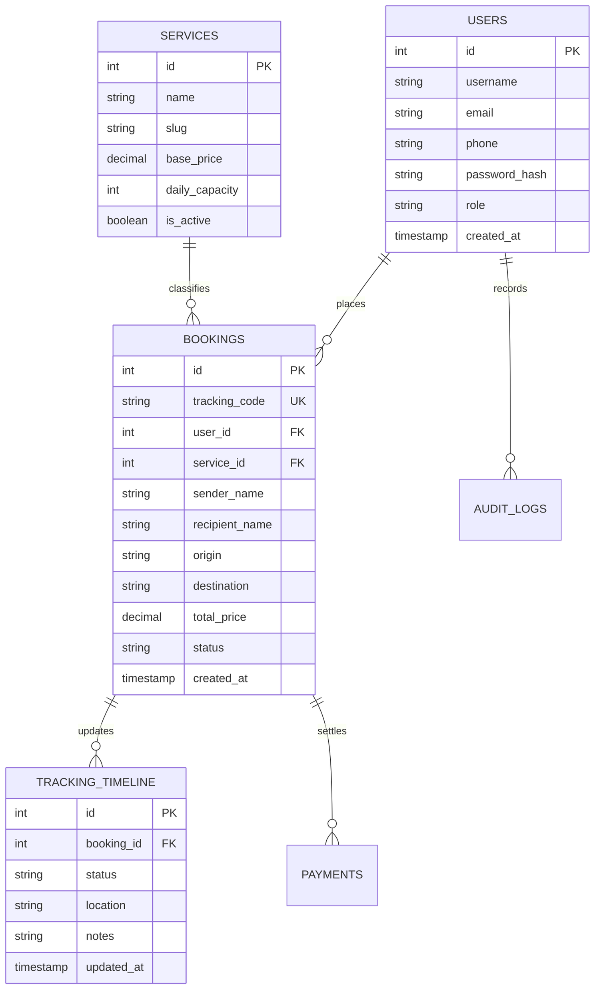

# 🚚 YOCOR Express Logistics

<div align="center">

  

  <h3>⚡ Modern Inter-Island Freight, Courier Dispatch & Live Tracking System</h3>

  <p>
    A high-performance, full-stack logistics management platform built for nationwide multi-modal freight forwarding, real-time waybill tracking, dynamic rate calculation, and enterprise administrative dispatch.
  </p>

  <p>
    <a href="#-key-features">Features</a> •
    <a href="#-tech-stack--architecture">Tech Stack</a> •
    <a href="#-security-hardening--pentest-report">Security</a> •
    <a href="#-installation--setup">Quick Start</a> •
    <a href="#-database-schema">Database</a> •
    <a href="#-project-structure">Project Structure</a>
  </p>

  <!-- Badges -->
  <p>
    
    
    
    
    
    
  </p>

</div>

---

## 📖 Overview

**YOCOR Express Logistics** is a web-based courier and cargo dispatch management system engineered specifically to resolve the logistical complexities of multi-island archipelago operations in the Philippines. 

From fast parcel air freight to heavy sea cargo and localized ground transit, YOCOR Express automates the entire supply chain workflow—from instant customer quote estimation and automated unique waybill code generation (`YR-XXXXXX`) to real-time administrative status checkpoint tracking, proof-of-payment verification, and live audit logging.

---

## ✨ Key Features

### 👤 Customer Experience & Dispatch Booking
- **Smart Waybill Generation:** Automatically issues collision-safe, 6-character alphanumeric tracking codes prefixed with `YR-` (e.g., `YR-A89KZ2`).
- **Dynamic Cost & Island Transit Engine:** Calculates real-time rates based on parcel dimensions, chargeable volumetric vs. dead weight, and multi-island destination routing (Luzon, Visayas, Mindanao).
- **Live Interactive Tracking:** End-to-end milestone timeline tracing package journey states (`Order Placed` ➔ `Dispatched` ➔ `In Transit` ➔ `Out for Delivery` ➔ `Delivered`).
- **Official Digital Waybill Receipts:** Printable, branded invoices containing customer contact info, complete sender/receiver credentials, package manifests, and itemized payment breakdowns.
- **Payment Verification Portal:** Integrated payment proof submission (GCash, Maya, Bank Transfer) with receipt verification status.

### 🛡️ Administrative Command Center
- **Mission Control Dashboard:** Instant visual analytics of total active bookings, revenue metrics, package volume distributions, and pending dispatch actions.
- **Multi-Service Fleet & Capacity Management:**
  - Real-time batch-editing for daily vehicle capacities and base price rates across service tiers.
  - Granular control to deactivate or permanently delete service tiers with database referential safety checks.
- **Dynamic Checkpoint & Timeline Management:** Real-time updates for location coordinates, transit progress percentages, and status logs per shipment.
- **Inquiry & Ticket Center:** Centralized inbox for handling customer support inquiries with integrated ticket status toggles and deletion features.
- **Immutable Audit Logging:** System activity tracking with administrative clear-log capabilities for operations audits.

---

## 🔒 Security Hardening & Pentest Report

The application was systematically evaluated and hardened against **OWASP Top 10** attack vectors via white-box and black-box penetration assessments:

```
[+] PENTEST AUDIT RESULT: ZERO CRITICAL / HIGH VULNERABILITIES IDENTIFIED
```

| Security Layer | Implementation Detail |
|---|---|
| **Session Security** | Strict session initialization with `HttpOnly=true`, `SameSite=Lax`, `use_only_cookies=1`, and automatic session ID regeneration on authentication. |
| **Credential Safety** | Sensitive environment configuration strictly separated into `.env` (git-ignored) with automatic fallback via `loadEnv()`. |
| **Dotfile Shielding** | Apache `.htaccess` rules deny direct HTTP access to sensitive config files (`.env`, `.git`, `.env.example`). |
| **Brute-Force Defense** | Dual-layer login rate limiting restricting failed attempts to 5 consecutive strikes with an automated 60-second cooldown period. |
| **Injection Mitigation** | Strict parameterized statements (`PDO::prepare`) throughout all customer and administrative database queries. |
| **Data Hygiene & XSS** | Context-aware sanitization and HTML entity encoding (`htmlspecialchars`) applied to all dynamic outputs and waybill receipts. |

---

## 🛠️ Tech Stack & Architecture

```
yocor-express/
├── Apache Web Server (VirtualHost & .htaccess URL rewriting)
│
├── Front Controller & Routing Router (index.php)
│   ├── Client Layer (Customer Dashboards, Booking, Tracking, Waybills)
│   └── Admin Layer (Fleet Manager, Checkpoints, Inquiries, Audit Logs)
│
├── Business Logic & Helper Layer
│   ├── app/database/helper.php     (Sessions, .env Loader, Security, Rate Limiter)
│   ├── app/database/config.php     (PDO Connection Pool, Waybill Code Generator)
│   └── app/database/validation.php (Sanitization & Input Validators)
│
└── MySQL / MariaDB Relational Database (yocor_express schema)
```

- **Backend:** PHP 8.2 (Procedural + Object-Oriented PDO)
- **Database:** MySQL / MariaDB (Default Port: `3307` / `3306`)
- **Frontend / Styling:** Vanilla CSS, Tailwind CSS (Utility classes), FontAwesome 6
- **Typography:** Google Fonts (*Montserrat*, *Roboto*)
- **Environment Management:** Native lightweight `.env` parser (`loadEnv()`)

---

## 🚀 Installation & Setup

### 1. Prerequisites
Ensure you have the following installed on your machine:
- [XAMPP](https://www.apachefriends.org/) (PHP 8.2+ and Apache)
- MySQL / MariaDB Database Server
- Git

### 2. Clone the Repository
Clone the project into your local XAMPP web server directory:
```bash
cd C:\xampp\htdocs
git clone https://github.com/elxyr0927-ship-it/WEB-DEV-MIDTERM-PROJECT.git Express
cd Express
```

### 3. Environment Configuration
Copy the template configuration file to `.env`:
```bash
cp .env.example .env
```
Open `.env` in any text editor and configure your database parameters:
```ini
DB_HOST=127.0.0.1
DB_PORT=3307
DB_NAME=yocor_express
DB_USER=root
DB_PASS=
```
> **Note:** If your MySQL in XAMPP runs on the standard port, change `DB_PORT=3307` to `DB_PORT=3306`.

### 4. Database Setup
1. Launch **XAMPP Control Panel** and start **Apache** and **MySQL**.
2. Navigate to `http://localhost/phpmyadmin` in your web browser.
3. Create a new database named `yocor_express`.
4. Import the provided project database dump or run the table creation scripts.

### 5. Launch the Application
Open your browser and navigate to:
```text
http://localhost/Express
```

---

## 🗄️ Database Schema

The core relational structure driving the platform:



---

## 📂 Project Structure

```text
c:\xampp\htdocs\Express/
├── .env.example                # Sample environment configuration template
├── .gitignore                  # Git ignore rules protecting .env and credentials
├── .htaccess                   # Apache URL rewriting & sensitive dotfile protection
├── index.php                   # Master front controller & router whitelist
├── login.php                   # Authentication gateway with rate-limiting defense
├── register.php                # Customer onboarding & account creation
├── process_booking.php         # Core transactional booking dispatch processor
├── logout.php                  # Session termination & security flush
├── app/
│   ├── database/
│   │   ├── config.php          # Database PDO connection & code generator
│   │   ├── helper.php          # Session hardening, .env loader & utilities
│   │   └── validation.php      # Form sanitization & validation logic
│   ├── includes/               # Reusable headers, footers & landing sections
│   └── pages/
│       ├── admin_dashboard.php # Mission control & batch fleet management
│       ├── admin_services.php  # Service tiers & pricing admin
│       ├── admin_inquiries.php # Customer message dispatch & inquiry manager
│       ├── admin_booking_timeline.php # Shipment milestone updates
│       ├── booking.php         # Customer booking form & dimension calculator
│       ├── customer_dashboard.php # User order histories & tracking hub
│       ├── payment.php         # Proof-of-payment upload handler
│       ├── receipt.php         # Dynamic printable waybill invoice
│       ├── tracking.php        # Real-time package tracking page
│       ├── contact.php         # Inquiry submission form
│       └── security.php        # Security disclosures & policy
└── public/                     # Brand vector assets, logos & styling
```

---

## 🧑‍💻 Contributing & Academic Attribution

This project was engineered as a **Web Development Midterm Project** demonstrating real-world software engineering, database normalization, responsive design systems, and defense-in-depth cybersecurity.

- **Developer:** [elxyr0927-ship-it](https://github.com/elxyr0927-ship-it)
- **Course:** Web Development / Computer Science
- **Project:** YOCOR Express Logistics Management System

---

## 📄 License

Distributed under the **MIT License**. See `LICENSE` for more information.

<div align="center">
  <sub>Built with ❤️ and dedicated to secure, seamless Philippine logistics.</sub>
</div>
